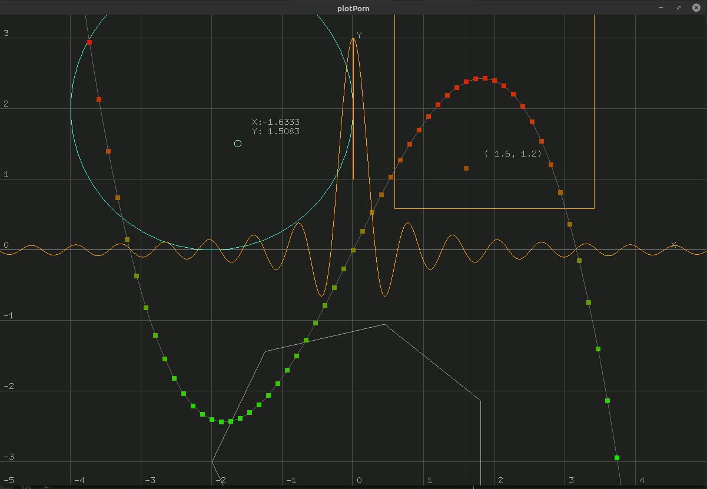
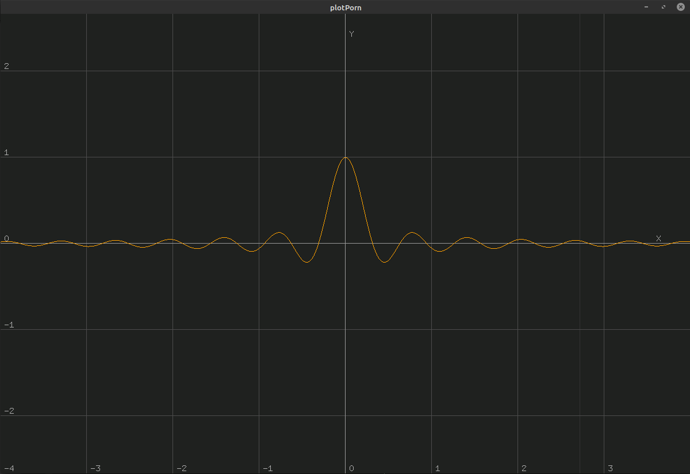
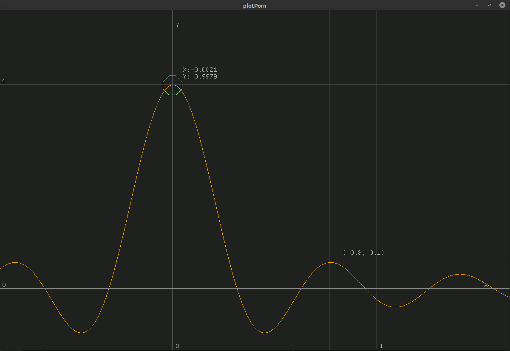
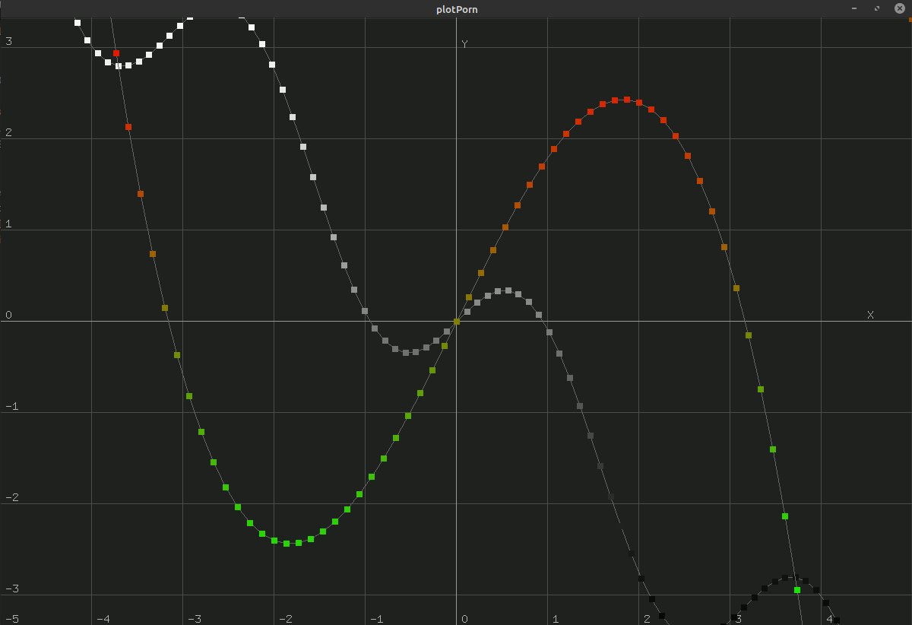
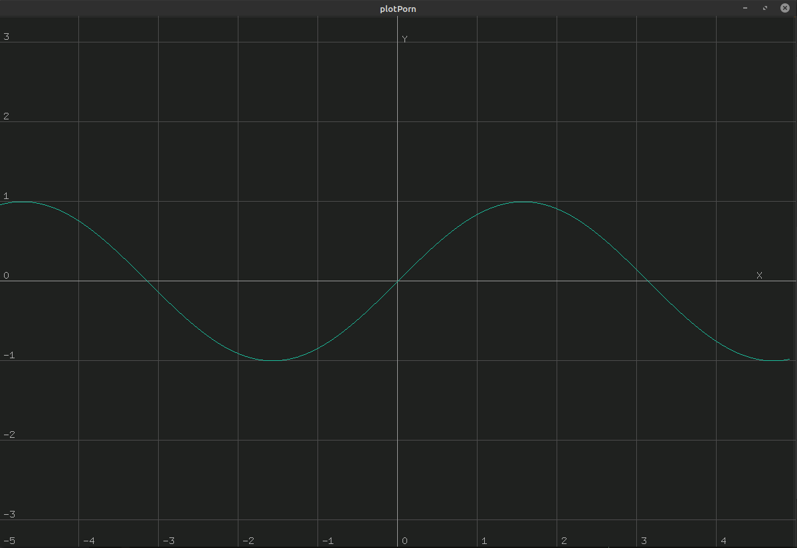
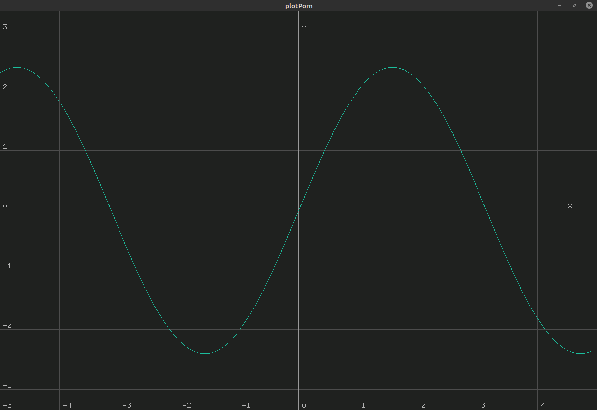
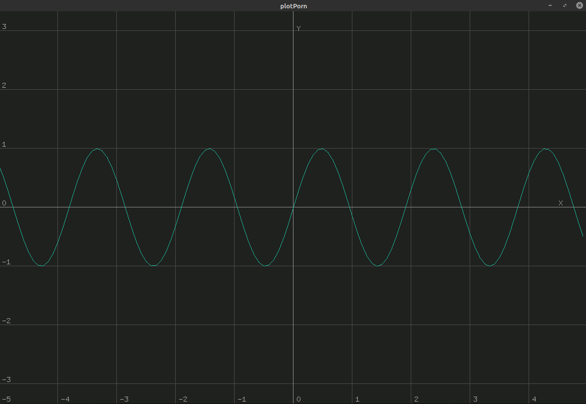
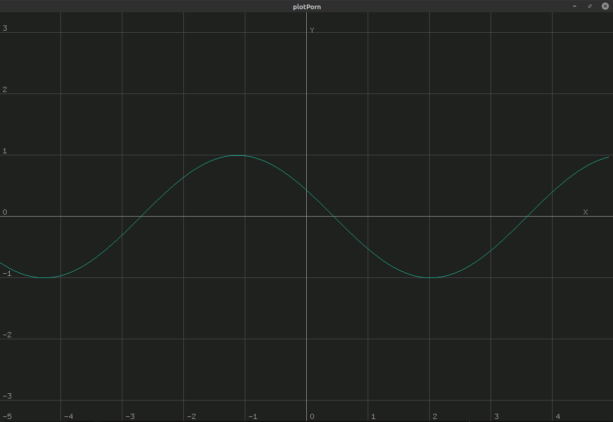

# Welcome to plotPorn

**plotPorn** is a python plotting library based on _OpenGL_.

## What you can do with plotPorn

### Contents

1. [The `Plot` object](#the-`plot`-object)
2. [The `Scatter` object](#the-`scatter`-object)
3. [The `Parametric` object](#the-`parametric`-object)
4. [To do](#to-do)

### The `Plot` object

Let's say you want to plot a  _sine cardinal_ function, like this:
$$
f(x)=\text{sinc}(10\;x) =\dfrac{\sin(10\;x)}{10\; x}
$$

then you can simply pass it to the  ` Plot.Plot`  object: 

~~~python
import math
import Plot

def sinc(x: float) -> float:
	''' Sine cardinal function '''
	
	if x == 0:		return 1
	
	return math.sin(10 * x) / (10 * x)
	
plot = Plot.Plot(sinc)
plot.plot()
~~~

and obtain:

To navigate the plot use the keys of your keyboard:

|   KEY   |        EFFECT         |
| :-----: | :-------------------: |
|   `+`   |        zoom in        |
|   `-`   |       zoom out        |
| &#8594; | move the camera right |
|    ←    | move the camera left  |
|    ↑    |  move the camera up   |
|    ↓    | move the camera down  |

If you are interested in some values of your function just use your mouse! You can leave coordinate points by left clicking and then remove them with the ` c`  key:

In  "_function_" mode **plotPorn** draws your function each time you zoom so that you will never lose resolution.

----

### The `Scatter` object

You might be interested though to plot discrete data collected from some cool science you did. In this case you can do something like this:

~~~python
import Plot

plot = Plot.Plot()
plot.addScatter(X, Y)
plot.plot()
~~~

----

### The `Parametric` object

Say now you want to know what happens when you change some parameters in your function. Then you can plot a parametric function of the kind:

~~~python
Callable([float, List[float]], float)
~~~

For instance consider the function:
$$
f(x; A, \omega, \phi) = A\; \sin(\omega \; x + \phi) \\
f(x; \text{params}) = \text{params}[0] \; \sin(\text{params}[1] \; x + \text{params}[2]) \\
\text{with} \quad \text{params} \in \mathbb{R} \times [0, 2 \pi ) \times [0, 2 \pi)
$$
then you can implement it in python as:

~~~python
import math

def parametricSine(x: float, params: List[float]) -> float:
	
	return params[0] math.sin(params[1] * x + params[2])
~~~

and plot it in **plotPorn** , adding the initial value of the parameters  `initialParams` , like this:

~~~python
import Plot

initialParams = [1.0, 1.0, .0]

plot = Plot.Plot()
plot.addParametric(parametricSine, intialParams)
plot.Plot()
~~~

When the  **plotPorn** window opens you can change the parameters with your keyboard:

| KEY  |               EFFECT                |
| :--: | :---------------------------------: |
| `w`  |    switch to the next parameter     |
| `d`  | increase the value of the parameter |
| `a`  | decrease the value of the parameter |

let's see what happens changing the value of the parameters with our keyboard:

|                                           |                                                |
| :---------------------------------------: | :--------------------------------------------: |
|               initialParams               |                   params[0]                    |
|  |  |
|                 params[1]                 |                   params[2]                    |
|     |          |

---

### To do

- [ ] dragging the plot with the mouse
- [ ] `Set ` class to define areas
- [ ] command description